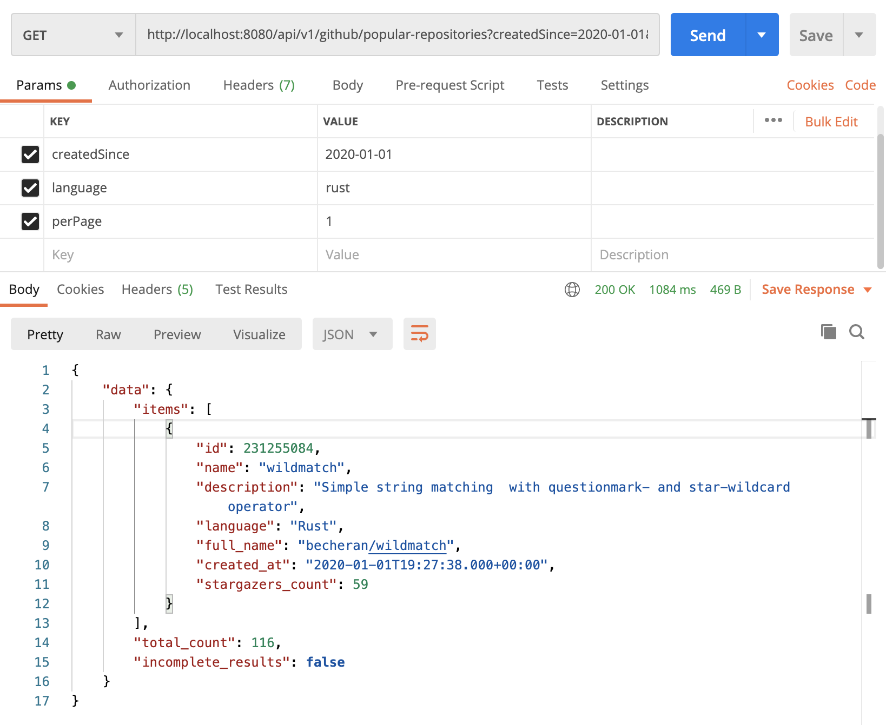

## Features

This API provides endpoint and tools for the following:

* GET a popular repositories: `GET /api/v1/github/popular-repositories`

### Details

For example this end-point is called to get popular repositories since `2020-01-01`
related to the Rust language, and we want to show just one entity per page.

It's already sorted by count of stars.

`GET /api/v1/github/popular-repositories?createdSince=2020-01-01&language=rust&perPage=1`

**Body Example:**

```json
{
  "data": {
    "items": [
      {
        "id": 231255084,
        "name": "wildmatch",
        "description": "Simple string matching  with questionmark- and star-wildcard operator",
        "language": "Rust",
        "full_name": "becheran/wildmatch",
        "created_at": "2020-01-01T19:27:38.000+00:00",
        "stargazers_count": 59
      }
    ],
    "total_count": 116,
    "incomplete_results": false
  }
}
```

**Example of the call in Postman:**


